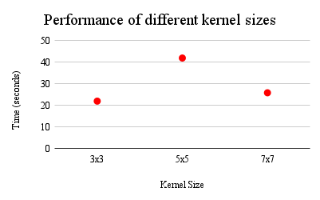

# Image Enhancement

## Introduction

Image enhancement is a process in Computer Vision that deals with the modification of images, to 
improve their quality and render them more viable and effective for computer vision tasks.

This project explores image enhancement, particularly image sharpening and image denoising, for the 
purpose of understanding the different techniques that are involved in carrying them out effectively.

## Implementation
### Task 1 - Image Sharpening

Task 1 develops a program to perform _unsharp masking_ on input images, in order to enhance their major
edges.

Unsharp masking is performed in two steps, by following the folowing formula:

- **Step 1: I - G(I) = D(I)**: here G(I) is the blurred image using a Gaussian kernel/filter of choice,
and D(I) is the residual image containing edge details.

- **Step 2: I + D(I) = Final**: adding the details back to image reinforces the edge information creating a 
sharper image.

**Final** is the final sharpened image

To achieve this, a method called `convolve(image, kernel)` was implemented.
`convolve()` performs a sliding convolution of `image` and `kernel`, as is common in Computer Vision operations.

For the purpose of this task, a Gaussian filter is convolved with the original image, and the result from that 
operation is subtracted from the original image. We add the difference back to the original image to generate 
the final sharpened image. The Gaussian filter used is defined as follows:

```
gaussian = np.array((
        [1/16, 1/8, 1/16],
        [1/8, 1/4, 1/8],
        [1/16, 1/8, 1/16]), dtype="float32")
```
The `convolve()` function was taken from [Adrian Rosebrock] (https://pyimagesearch.com/2016/07/25/convolutions-with-opencv-and-python/),
however, the following changes were made:

- To allow the function to process color images, the convolution process takes place in all 3 dimensions. This was not previously the case, and resulted in the function producing only greyscale images
- After much experimentation and difficulties, a kernel was found which worked well for this task. This kernel is different from any of those used in the original `convolve()` function

### Task 2 - Image Denoising

Denoising is the process of removing or reducing unwanted variations in brightness or color that distort the 
visual appearance of an image, otherwise known as noise. 

Task 2 implements three different denoising methods, namely: mean filtering `mean_filter(image)`, gaussian 
smoothing `gaussian_smoothing(image)`, and median filtering `median_filtering(image)`.

All three functions utilize the same convolution process from Task 1 with the following modifications:

- `mean_filter()` uses the kernel
  ```
  kernel = np.array((
        [1/9, 1/9, 1/9],
        [1/9, 1/9, 1/9],
        [1/9, 1/9, 1/9]), dtype="float32")
  ```
- `gaussian_smoothing()` uses the kernel
  ```
  kernel = np.array((
        [1/16, 1/8, 1/16],
        [1/8, 1/4, 1/8],
        [1/16, 1/8, 1/16]), dtype="float32")
  ```
- `median_filter()` does not use any kernel, but rather assigns to the necessary output the median of the region of interest
  ```
  k = np.median(roi)
  output[y - pad, x - pad, z] = k	
  ```

For the images `gb_image1.jpg` and `gb_image2.jpg`, gaussian_smoothing() works best because Gaussian smoothing
is effective in reducing high-frequency noise in images, which both images contain. High-frequency noise often 
appears as random variations in pixel intensity, and the Gaussian filter, by design, attenuates high-frequency 
components.

For the images `sp_image1.jpg` and `sp_image2.jpg`, median_filter() works best because the median filter is a 
non-linear filter, meaning that the output pixel value is not a linear combination of the input pixel values. 
In the case of salt and pepper noise, where isolated pixels have extreme values, a non-linear filter like the 
median filter works best.

## 498 Graduate Level Additional Questions
### Task 1 - Image Sharpening
The following filter can sharpen the images in one step:
```
 sharpen = np.array((
 [0, -1, 0],
 [-1, 5, -1],
 [0, -1, 0]), dtype="int")
```
It works by emphasizing the intensity differences between the central pixel and its neighbors. The central 
pixel is multiplied by a large positive weight (5), enhancing its contribution to the output.

The surrounding pixels are multiplied by negative weights, reducing their contribution to the output. The 
overall result is that edges and fine details in the image are enhanced, leading to a sharpened appearance.

### Task 2 - Image Denoising

The following times were taken for convolution to be performed using different kernel sizes

| Kernel Size | Time taken for Convolution (s) |
|----------|----------|
| 3x3 | 21.93853378 |
| 5x5 | 41.94101977 |
| 7x7 | 25.81305599 |



The smallest kernel size demonstrated the fastest convolution time, taking approximately 21.94 seconds. 
This result aligns with the expectation that smaller kernel sizes generally lead to quicker computations.

With an increase in kernel size to 5x5, the time taken for convolution notably increased to 41.94 seconds.

The 7x7 kernel showed a reduction in processing time compared to the 5x5 kernel, taking approximately 25.81 
seconds. One potential explanation could be related to the coverage of more ground at once with the use of 
a larger kernel. 


## References
- [Convolutions with OpenCV and Python] (https://pyimagesearch.com/2016/07/25/convolutions-with-opencv-and-python/)
